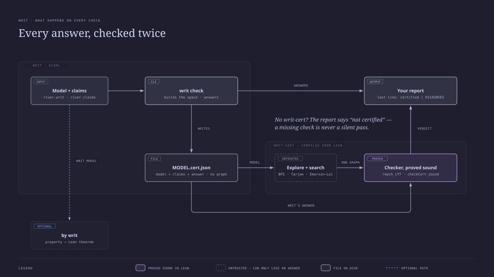

# Certificates

Every `writ check` writes `MODEL.cert.json` beside the model (`--certificate
FILE` to put it elsewhere, `--no-certificate` to skip it) — everything a second
checker needs to re-derive the report — and hands it at once to `writ-cert`,
compiled from [`lean/`](../lean/) and shipped in writ's image. Its verdict is
the report's last line:

```console
$ writ check river.writ --claims river.claims
…the usual report…
certified: every answer re-derived from the model (writ-cert)
```

`writ-cert` is looked for in `$WRIT_CERT`, then beside the `writ` executable,
then on the `PATH`; if missing, the line reads `not certified: writ-cert is not
installed`. If it refutes the report, the line is `NOT CERTIFIED`, the refuted
answers follow, and the exit status is 1. With `--json` the result is the
`certification` field.

Run by hand, `writ-cert` prints a line-by-line account:

```console
$ writ-cert river.cert.json
writ 0.2.0 — certificate checked against the kernel semantics
certified    states  — 36 — exactly the reachable situations, pairwise distinct
certified    edges  — 76 — every move at every situation, as the semantics gives it
certified    dead ends  — none
certified    gaps  — none
certified    holds  solvable  — satisfied at #34; witness: a shortest route, 7 moves
certified    fails  no-blunders  — #1 is in a closed, F-free set of 26; witness: a shortest route to #1, 1 moves
verdict: every answer certified
```



## Why

writ's negative answers — *no* reachable situation breaks the law, *every* run
decides — otherwise rest on one OCaml engine. The certificate lets another
program check them against the kernel-spec semantics (§10, §12, §16.1), so an
engine bug is caught instead of believed.

## What is trusted, and what is not

| Trusted (not re-checked)                         | Checked                                                  |
|--------------------------------------------------|----------------------------------------------------------|
| writ's reader, `load` resolution and form expansion — the certificate's `model` is what they produced | the state space: the checker builds its own and proves it is exactly the reachable one |
| writ's `n/a` decision (a formula naming structure the schema lacks) | every `holds` / `fails` verdict, all four modalities, fairness included |
| the Lean kernel and, for `writ-cert` itself, the Lean compiler | every witness: a real route, landing where writ says, and shortest |
|                                                  | the counts: states (pairwise distinct), edges, law violations, dead ends, gap sites |

The checker's own search (breadth-first, Tarjan, Emerson–Lei) is unproved; only
the conditions its evidence must meet are proved sound. A search bug can cost
an answer (`uncertified`), never produce a wrong one.

## The format (version 2)

One JSON object — the question, and writ's answer:

```json
{
  "format": "writ-certificate", "version": 2, "writ": "0.2.0",
  "model": {
    "types":       [{"name": "bank", "members": ["left", "right"]}],
    "layout":      [{"src": "farmer", "arrow": "at"}],
    "fixed":       [{"src": "docket", "arrow": "investigator", "value": "watchdog"}],
    "initial":     ["left"],
    "transitions": [{"name": "cross-goat-LR", "guard": G, "effects": [E]}],
    "equations":   [{"name": "same-agency", "subject": "case", "body": G}]
  },
  "properties": [{"name": "solvable", "modality": "possible", "fair": [],
                  "formula": G, "applicable": true}],
  "report": { …exactly what `writ check --json` prints (docs/json.md)… }
}
```

- **model** is the kernel model after the front end: forms expanded, loads
  spliced, the instance split into wiring (`fixed`) and the mutable slots
  (`layout`, which fixes the order of every situation's cells). `members` is
  each type's extent as `some` ranges over it. A transition's `name` is the
  label routes carry — its name, or `#i` by position for an unnamed one.
- **Guards** are tagged lists: `["and", G…]`, `["or", G…]`, `["not", G]`,
  `["is", PATH, RHS]`, `["defined", PATH]`, `["some", X, TYPE, G]`. A PATH is
  `[root, step…]`; an RHS is `{"lit": V}` or `{"chain": PATH}`. **Effects** are
  `["set", PATH, RHS]`, `["vacate", PATH]`, `["gap", MSG]`.
- **properties** are the questions, lowered; `applicable` is writ's n/a test.
- **report** is the answer being certified, unchanged.

The certificate carries no state graph: the model determines it, and
`reach_iff` holds for any graph that passes the check. The checker explores the
model itself in writ's breadth-first order, so a situation index means the same
situation to both. (Version 1 also carried writ's graph, which made
certificates about 20 times larger.)

## The checker

See [`lean/README.md`](../lean/README.md): the reference semantics, the
soundness theorems, `writ-cert`, and `by writ`.
