# Pol — Language Specification

## Contents

- [**Prologue**](#prologue)
- [**Part I — Introduction**](#part-i--introduction)
  1. [Pivotal ideas](#1-pivotal-ideas)
  2. [Ologs, and what Pol adds](#2-ologs-and-what-pol-adds)
  3. [Three scenarios](#3-three-scenarios)
  4. [The running example](#4-the-running-example)
- [**Part II — The language**](#part-ii--the-language-normative) *(normative)*
  5. [Lexical structure](#5-lexical-structure)
  6. [Files](#6-files)
  7. [Names](#7-names)
  8. [Schemas](#8-schemas)
  9. [Instances](#9-instances)
  10. [Transitions](#10-transitions)
  11. [Forms](#11-forms)
  12. [The meaning of a model](#12-the-meaning-of-a-model)
  13. [Errors](#13-errors)
  14. [Conformance](#14-conformance)
- [**Part III — Standard tool interface**](#part-iii--standard-tool-interface-normative-for-tools) *(normative for tools)*
  15. [Required reporting](#15-required-reporting)
  16. [Claims files](#16-claims-files)
  17. [Comparison, search, and export](#17-comparison-search-and-export)
  18. [Command line](#18-command-line)
- **Appendices**
  - [A — Collected grammar](#appendix-a--collected-grammar)
  - [B — Keyword index](#appendix-b--keyword-index)
  - [C — The river](#appendix-c--the-river)
  - [D — The island](#appendix-d--the-island)
  - [E — Why seven ideas](#appendix-e--why-seven-ideas-no-more-no-fewer)
  - [F — The wish list, answered](#appendix-f--the-wish-list-answered)
  - [G — Problems tractable with Pol](#appendix-g--problems-tractable-with-pol)
  - [H — Design notes: neighbouring languages](#appendix-h--design-notes-neighbouring-languages)
  - [I — Pol as a category-theory workbench](#appendix-i--pol-as-a-category-theory-workbench)
  - [J — Categorical cheat-sheet](#appendix-j--categorical-cheat-sheet)

## Prologue

**The river.** *A farmer stands on the left bank with a wolf, a goat,
and a cabbage. The boat holds the farmer and at most one passenger.
Whenever the farmer is not on a bank, appetite takes over there: the
wolf eats the goat; the goat eats the cabbage. Can everything reach the
right bank intact?*

**The island.** *On Raymond Smullyan's island, every native is a knight
or a knave: knights always tell the truth, knaves always lie. Three
natives are interviewed; each says something about themselves. Two say
"I am a knight" — either kind could say that, and the rules leave both
readings open. But one native says: **"I am a knave."** A knight cannot
say it (it would be a lie); a knave cannot say it (it would be the
truth).*

Suppose we wanted one tool for both — not solvers with the river or
the island built in, but a tool where **each puzzle is written down**
and questions are put to it. Between them, the puzzles dictate the wish
list:

1. A way to write **what kinds of pieces there are** and what each one
   points at — banks and positions; natives, their kinds, their
   recorded statements. *(both)*
2. A way to write **one starting arrangement** — and a way to say a
   slot holds *nothing*, as itself: the eaten goat is *gone*, the
   uninterviewed native's kind is *not yet known*. Neither is a trick
   value on an imaginary third bank. *(both)*
3. A way to write **the moves** as a condition and a change: "only if
   the farmer and the goat stand on the same bank, they may cross
   together"; "a native who said *knight* may be recorded as either
   kind". *(both)*
4. The tool should **try every sequence of moves there is** — all of
   them — so that "no solution exists" is a proved fact, not a failure
   to find one. *(river)*
5. Every verdict should **show its route**: the crossing that works, or
   the exact sequence of moves that ruins everything. *(river)*
6. Some questions want a **list**, not a yes or no: *which natives
   could be knights? which arrangements are consistent?* — answered
   with the satisfying cases themselves. *(island)*
7. The **laws should be written as laws** — "a knight's statement is
   true" — and an arrangement violating a law should be flagged and
   traced, never silently deleted. *(island)*
8. The tool should detect **points of no return**: arrangements still
   reachable, from which winning is gone forever. *(river)*
9. Where the rules are **silent** — the native who says "I am a
   knave" — the tool should mark the hole rather than invent an
   answer. *(island)*
10. We will want **variants**: a bigger boat, a fourth native, a
    removed move — and a comparison: what became possible, what was
    lost. *(both)*
11. We will want to **name compound moves** — "ferry the goat" —
    without extending the tool itself. *(both)*
12. The **questions should live apart from the puzzles**, so the same
    questions can be put to every variant unchanged. *(both)*

---

Pol is a language for modelling rule-governed worlds and proving facts
about their consequences. A Pol model consists of:

- a **schema** — the kinds of things that exist, the typed arrows
  between them, and the laws that certain arrow-chains must agree;
- an **instance** — one concrete filling of the schema, with some slots
  allowed to be empty;
- **transitions** — moves, each stating where it exists and what it
  changes.

The meaning of a model is the complete space of situations its moves can
generate. That space is finite and fully defined by this specification
(§12), independent of any implementation.

*In mathematical terms: a finitely presented category; a finite instance
in Par(FinSet) — finite sets and partial functions; and a formula syntax
presenting partial maps. Mathematical names appear in parentheses after
the plain statement they name; they are never required to read on.*

---

# Part I — Introduction

## 1. Pivotal ideas

The Prologue asked for twelve things; the language commits to seven
ideas. A wish states a demand in the puzzles' terms; an idea states the
commitment that answers it — so the texts differ on purpose, and the
counts do too: an idea often grants several wishes, and some wishes
need two ideas at once. That the seven are independent — none
derivable from the rest — is Appendix E.

1. **The absent is representable.** *(grants wishes 2, 9)*
   An office may be vacant; a rule may be silent. Both are first-class:
   a slot may be *empty* (§8.3), and a move may end the model
   (§10.4) — no placeholder members, no artificial "end" states.
   Whatever holds of absence can be stated and checked.
2. **Law is an observable, not a filter.** *(grants wish 7)*
   Declaring a law (§8.6) does not make it true. Situations that
   violate it remain in the model's meaning and are reported (§15).
   Illegality is thereby *data*: which move can break which law, in
   which situations, reached by which route.
3. **A small text denotes a large, fully known object.** *(grants wishes 1, 3, 4, 5, 8)*
   The model is a finite presentation — a page of rules; its meaning is
   every situation those rules can produce (§12). Because every list in
   the language is finite (§1 of Part II onward: no numbers, no
   recursion, no unbounded chains), that meaning is finite, and any
   question about it can be answered by exhaustion, with a concrete
   route as evidence.
4. **Definition and interrogation are separate documents.** *(grants wishes 5, 6, 8, 12)*
   A model contains no questions. Questions — "can this ever happen",
   "can this always still happen", "does this law hold" — live in
   separate files (§16) and cannot change what the model is. One
   question suite can be asked of many models; one model can face many
   suites.
5. **Two kinds of time, two systems.** *(grants wish 10)*
   Time *inside* the world is a chain of moves — derived from the
   model, never written (§12). Time *of authorship* — amendments,
   versions, history — belongs to version control (§9.3), and the two
   never mix. Comparing versions means comparing what holds of
   world-time before and after an authorship-time change (§17).
6. **Rules, not actors.** *(grants wish 3)*
   The language has no notion of who performs a move. Where agency
   affects what can happen, it is world-state — an arrow, tested in a
   guard. Where it does not, it is a name or a comment. This is why one
   form — a condition and a change — covers everything that happens:
   the farmer's ferrying and the wolf's appetite are the same kind of
   move.
7. **Vocabulary grows; meaning does not.** *(grants wish 11)*
   The extension mechanism (§11) can only rename and paste — it cannot
   compute. Entire domain vocabularies are libraries built from it,
   while the semantic core stays at twenty-eight words (Appendix B),
   and every error still points at a line the author wrote.

## 2. Ologs, and what Pol adds

Pol's map layer is an **Olog** ("ontology log") — a notation from
category theory for writing ontologies as boxes and arrows. Ologs are
good at five things, and Pol keeps every one whole:

- **Saying what exists.** Boxes force the commitment — a bureau, a
  case, a person. Most modelling failures are failures to say what
  kinds of things there are.
- **Typed, chainable relations.** Every arrow runs from a named type
  to a named type, so relations compose:
  `docket.investigator.independence` is checkable text.
- **Laws as diagrams.** Two routes that must agree — "the
  investigator's independence equals the prosecutor's" — are written
  as equations: the formal content of "the rules require".
- **The map apart from its filling.** The world's shape and one
  concrete filling of it are separate documents, and "is this filling
  legal for this map" is a checkable question.
- **Translation.** A dictionary from one map into another — including
  an older version of itself — can be checked for honesty: nothing
  untranslated, shapes preserved, laws carried over.

What an Olog lacks is everything the puzzles demanded beyond the map.
An Olog is a photograph:

- **no time** — nothing moves *(Pol adds transitions, §10)*;
- **no possibility** — no "can this ever happen", no traps *(the
  generated meaning, §12, and the questions of §16)*;
- **no absence** — every arrow must answer *(`vacant` slots and `gap`
  moves, §8.3, §10.4)*;
- **no violation** — a filling that breaks a law simply does not count
  as a filling, so the illegal cannot be studied *(law as observable,
  §15)*;
- **no evidence** — a failed law has no counterexample artifact
  *(witnesses, §15–16)*.

Pol is the Olog kept whole, plus exactly these five additions, and
nothing else. The wish-by-wish map from the Prologue to the constructs
is Appendix F.

## 3. Three scenarios

**Institutional architecture.** *A state builds independent oversight —
anti-corruption agencies, prosecutorial pipelines — while its
legislature retains powers over those bodies: appointment, dismissal,
capture, restoration. The law also declares structural requirements:
the investigating and prosecuting agencies must stand on equal footing;
an assigned judge must be seconded from the proper body. Questions and
their mechanisms:*

| Question                                                                  | Mechanism                                                                                        |
| ------------------------------------------------------------------------- | ------------------------------------------------------------------------------------------------ |
| Can one lawful move permanently destroy accountability?                   | `live` (§16) — the answer carries the exact move sequence                                    |
| This amendment looks procedural — what does it actually change?          | `pol compare` (§17): preserved / lost / gained                                                |
| Which of our own powers can violate our own declared laws?                | equation observation (§15); `accept` records ownership                                         |
| Does this architecture have any reading in an external framework's terms? | schema dictionary checks (§16); an untranslatable arrow is named                                |
| Where do the written rules run out?                                       | `gap` (§10.4), listed with the shortest route in                                              |
| Is the bench staffed, and must it be?                                     | `vacatable` + `defined` (§8.3, §10.2); "always still staffable" is `(live (defined …))` |

**Regulated workflow.** *A claims or KYC operation: cases wired to
their reviewer and unit of record; a law that the approving officer
belongs to the unit of record; an assignee slot that may be empty; an
escalation boundary where the automated process ends.*

| Question                                                                     | Mechanism                                                |
| ---------------------------------------------------------------------------- | -------------------------------------------------------- |
| Can a case get stuck — reachable, but never settleable?                     | `live` (§16.1)                                        |
| Which reassignment moves can break the unit-of-record law?                   | equation observation (§15); `accept` records ownership |
| Did last quarter's process change quietly lose the settle-ability guarantee? | `pol compare` (§17): preserved / lost / gained        |
| May the assignee slot be empty here — and must it be filled?                | `vacatable` + `defined` (§8.3, §10.2)              |
| Where does the automated process end and a human take over?                  | `gap` (§10.4), listed with the shortest route in      |

**Access and privilege.** *Roles, grants, revocations; a law that
every admin-capable account traces to the security root.*

| Question                                                                                            | Mechanism                                                                                            |
| --------------------------------------------------------------------------------------------------- | ---------------------------------------------------------------------------------------------------- |
| Is revocation always still possible, or is some privilege permanent after the right grant sequence? | `live` (§16.1) — an irreversible grant is a designed latch or a defect; the model must say which |
| Which grant moves can break the root-tracing law?                                                   | equation observation (§15)                                                                          |
| Which accounts hold a given privilege now?                                                          | queries (§16.2)                                                                                     |
| Does this configuration occur, structure preserved, inside the approved reference model?            | morphism search (§17)                                                                               |

## 4. The running example

Used by every *Example* in Parts II–III: an oversight system with two
agencies, one case, one (possibly vacant) judge.

```lisp
(schema oversight
  (type indep-status (independent captured))
  (type stage-t (open concluded))
  (type person
    (arrow employer (to bureau) fixed))
  (type bureau
    (arrow independence (to indep-status)))
  (type case
    (arrow stage        (to stage-t))
    (arrow investigator (to bureau) fixed)
    (arrow prosecutor   (to bureau) fixed)
    (arrow judge        (to person) vacatable))
  (equation same-agency
    (= case.investigator.independence case.prosecutor.independence)))

(instance day-one (of oversight)
  (bureau watchdog prosecutions)
  (person alice)
  (case docket)
  (employer      (alice watchdog))
  (investigator  (docket watchdog))
  (prosecutor    (docket prosecutions))
  (independence  (watchdog independent) (prosecutions independent))
  (stage         (docket open))
  (judge         (docket vacant)))

(use oversight)
(initial day-one)

(transition capture-watchdog
  (when (is watchdog.independence independent))
  (do (set watchdog.independence captured)))

(transition restore-watchdog
  (when (is watchdog.independence captured))
  (do (set watchdog.independence independent)))

(transition conclude
  (when (and (is docket.stage open)
             (is docket.prosecutor.independence independent)))
  (do (set docket.stage concluded)))

(transition assign-judge
  (when (not (defined docket.judge)))
  (do (set docket.judge alice)))
```

The schema, drawn — boxes are types, arrows are how things point at each
other.

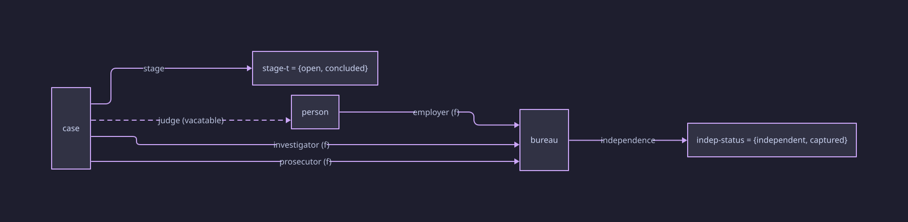

- dashed arrow — the slot may be empty (`vacatable`);
- `(f)` — set once, never changes (`fixed`);
- all other arrows — state.

The equation, drawn — two routes from `case` to `indep-status` that must
give the same answer (`bureau` appears twice, once per route):

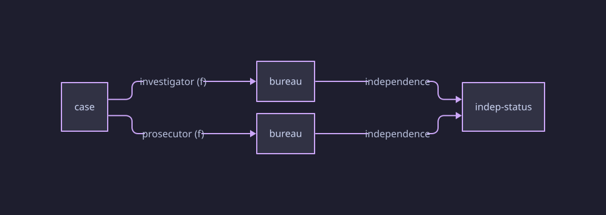

*(When two routes of a diagram must give the same answer, mathematicians
say the diagram commutes; an equation is a demand that a diagram
commute.)*

---

# Part II — The language *(normative)*

## 5. Lexical structure

### 5.1 Datums

- Pol text is s-expressions: **atoms** and parenthesised **lists**,
  collectively **datums**.
- `;` begins a comment running to end of line.
- Quoted atoms (`"…"`) carry spaces and punctuation; escapes are
  `\n \t \r \" \\`.
- Every datum carries its source position `line:col`; every error names
  one.

### 5.2 Chain atoms

- An atom containing `.` is a **chain atom**: the reader splits it on
  `.` into a chain (§8.5) before parsing.
- **Constraints**
  - Segments are bare atoms.
  - A chain atom may not begin or end with `.` (`.judge`, `docket.` —
    read errors).

*Example. `docket.investigator.independence` is one atom, read as the
chain `docket → investigator → independence`.*

## 6. Files

### 6.1 Roles

A `.pol` file is a flat sequence of top-level datums. Its role is
determined by content:

- **library** — contains only declarations: `schema`, `instance`,
  `form`, `load`.
- **model** — additionally contains exactly one `use`, exactly one
  `initial`, and any number of transitions.

**Constraints**

- A model contains exactly one `(use …)` and exactly one
  `(initial …)`.
- A loaded file must be a library (§6.2).

### 6.2 `load`

- **Syntax** — `(load "FILE")`.
- **Constraints**
  - The named file must exist and be a library.
  - Load edges must be acyclic; a cycle is an error naming the cycle.
- **Meaning**
  - The file's datums enter the loaded universe at this point, **once
    per file** regardless of how many load paths reach it.
  - Names are global across the loaded universe (§8.4); the
    once-per-file rule means a repeated-name error always signals two
    *different* declarations claiming one name — never the same file
    arriving twice.

*Example — the diamond. A model loads `stdlib.pol` and a domain library
`domain.lib.pol`; the domain library itself loads `stdlib.pol`. The
stdlib's datums enter once.*

> 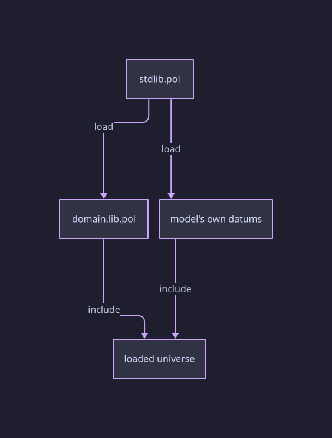

*Design note.* Inclusion is irreducibly about files — nothing in-file
can reach the filesystem. The once-per-file rule is gluing along the
shared part (*a pushout*); plain textual inclusion would make every
shared base library a wall of spurious repeated-name errors.

### 6.3 Versions

- **One file is one version of one model.** The filename names the
  model.
- Everything historical belongs to version control: the commit dates a
  version; a `Cite:` trailer carries its sources; the log is the
  history; comparison across versions is a tool operation over two
  files or two commits (§17).
- The language contains no construct referring to time, versions, or
  provenance.

*Example.*

```bash
git commit -m "amendment: judicial assignment reform" \
           -m "Cite: Amendment No. 12 of 2031"
pol compare --git HEAD~1 HEAD oversight.pol
```

## 7. Names

- **Global names** — types, entities, forms, equations. One namespace
  across the loaded universe; declaring an existing name is an error.
  There is no shadowing.
- **Arrow names** — scoped to the type that owns the arrow. A chain
  segment resolves through the type of the value before it.

*Example. `bureau` and `case` may each own an arrow named `status`; in
`watchdog.status` the segment resolves via `bureau`, in `docket.status`
via `case`. But a second `(type person …)` anywhere in the universe is
an error at the second declaration.*

## 8. Schemas

### 8.1 `schema`

- **Syntax** — `(schema NAME DECL…)` where each DECL is a `type`,
  `arrow`, or `equation`.
- **Constraints** — NAME is fresh (§7).
- **Meaning** — opens a named world map: the container that types,
  arrows, and equations belong to. Dictionaries, comparisons, and
  imports (§16–17) run between named schemas.

### 8.2 `type`

- **Syntax**
  - enumerated: `(type NAME (VALUE…))`
  - open: `(type NAME BODY…)` — BODY a sequence of `arrow` datums,
    possibly empty.
- **Constraints** — NAME fresh; VALUEs distinct.
- **Meaning**
  - A type is a kind of thing.
  - **Enumerated**: its possible values are exactly those listed —
    fixed by the schema.
  - **Open**: its members are supplied by the instance's roster
    (§9.2) — the schema does not know who exists.
  - There is no ordering among values and there are no numbers.

*Example. `(type indep-status (independent captured))` — every
independence value the model will ever mention.
`(type person (arrow employer (to bureau) fixed))` — persons exist only
once an instance names them.*

*Design note.* The enumerated/open split is the schema/instance
division of labour at the type level. Ordered scales are enumerated
types plus library forms spelling out their comparisons (§11, Example).

### 8.3 `arrow`, `to`, `of`, `fixed`, `vacatable`

- **Syntax**
  - in a type body: `(arrow NAME (to TYPE) FLAG…)`
  - at schema top: `(arrow NAME (of TYPE) (to TYPE) FLAG…)`
  - FLAG is `fixed` or `vacatable`, each at most once.
- **Constraints**
  - The `to` TYPE must be a *named*, declared type.
  - NAME fresh among the owner's arrows (§7).
- **Meaning**
  - An arrow says how one kind of thing points at another: from its
    owner (`of`, or the enclosing type) to its target (`to`).
  - Each entity's arrow has **one** answer — or none, if the arrow is
    `vacatable`. (Many-to-many relationships are modelled as a junction
    type with two fixed arrows; *a span*.)
  - `fixed` — the answer is set once by the instance and never changes:
    wiring.
  - default (no `fixed`) — the answer may change: state.
  - `vacatable` — the slot may be empty (§9.3).

*Example. `investigator` is wiring: in every reachable situation the
docket's investigator is `watchdog`. `stage` is state: it is what
`conclude` changes. An inline target — `(arrow stage (to (open concluded)))` — is an error: an unnamed value set could not own further
arrows, so every chain would silently end there.*

*Design note.* Named targets are what make chains checkable. The
wiring/state split defines what a situation *is* (§12.1) — it is
meaning, not annotation. The alternative to `vacatable` — a placeholder
member such as `nobody` — must leak into every type any chain reaches,
and a box labelled "a person" that means "a person or nothing" no
longer says what it contains.

### 8.4 *(covered by §7)*

### 8.5 Chains

- **Form** — `E.a₁.….aₙ`: start at an entity (or a variable bound by
  `some` or `where`), follow arrows; each arrow must start where the
  previous one landed.
- **Constraints** — chain typing is checked at read time: each segment
  must be an arrow owned by the type of the preceding value.
- **Meaning**
  - A chain has an **answer** in a given situation, or **no answer** —
    and no-answer propagates: a chain through an empty slot has no
    answer from that step on.
  - There is no operator for "follow this arrow any number of times": a
    chain is a literal finite word. "Can we ever reach…" is a question
    about moves (§16), not a chain.

*Example. With `docket.judge` vacant:
`(is docket.judge.employer watchdog)` — false;
`(is docket.judge.employer prosecutions)` — also false — both false is
the signature of an empty slot, not a contradiction;
`(defined docket.judge.employer)` — false, and tells the cases apart.*

### 8.6 `equation`, `=`

- **Syntax** — `(equation NAME (= CHAIN CHAIN))`.
- **Constraints**
  - Both chains start at the same type and end at the same type. The
    chains are written from the *type*, not an entity:
    `case.investigator.independence` here means "for every case…".
  - NAME fresh.
- **Meaning**
  - A law: for every entity of the common start type, in every
    situation, the two chains must give the same answer — **where both
    have answers**. Where either has no answer, the law does not apply
    there. (*Kleene equality.*)
  - Declaring a law does **not** make it true. Situations violating it
    are part of the model's meaning (§12) and are reported (§15). A law
    is a claim the world is measured against, not a filter on the
    world.

*Example. A second law: the judge must be seconded from the
investigating agency —*

```lisp
(equation judge-from-investigating-bureau
  (= case.judge.employer case.investigator))    ; both: case → bureau
```

> 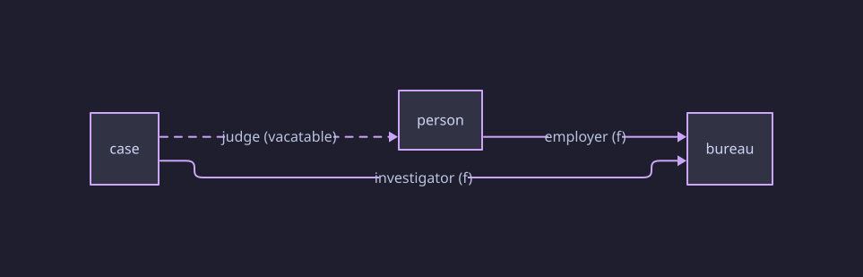

*While the bench is vacant the upper route has no answer, so the law
holds vacuously — an unstaffed bench breaks no seconding rule. After
`assign-judge`: upper route `alice.employer = watchdog`, lower route
`watchdog` — the law holds substantively. That a judge must also
exist is a separate question: `(live (defined docket.judge))` (§16).*

*Design note.* A law is not a guard: a guard asks about one situation;
a law is an identity ranging over every entity and every situation,
checked move-by-move (can this move break it? §15) and observed
everywhere. The claims-not-axioms behaviour (Pivotal idea 2) requires
laws to be *declared* datums.

## 9. Instances

### 9.1 `instance`

- **Syntax** — `(instance NAME (of SCHEMA) CLAUSE…)`; each CLAUSE is a
  roster clause or a valuation clause.
- **Constraints** — NAME fresh; SCHEMA declared.
- **Meaning** — one concrete filling of the schema: every open type
  gets its members, every arrow gets its answers, empty only where
  permitted. (*A functor Schema → Par(FinSet) — the pattern "a
  consistent, structure-respecting assignment", which recurs at §10
  and §16.*)

### 9.2 Roster clauses

- **Syntax** — `(TYPE ENTITY…)`, TYPE open.
- **Constraints** — each entity name fresh (§7); each entity belongs to
  exactly one type.
- **Meaning** — declares the members of the open type.

### 9.3 Valuation clauses, `vacant`

- **Syntax** — `(ARROW (ENTITY V)…)`, V a value, an entity, or
  `vacant`.
- **Constraints**
  - ENTITY belongs to the arrow's owner type; V belongs to the target
    type (or is `vacant`, permitted only for vacatable arrows).
  - Every `fixed` slot is set — wiring must be complete.
  - An unset mutable slot: defaults to empty if vacatable; otherwise an
    error.
- **Meaning** — fills the slots. `vacant` records an empty slot
  explicitly.

*Example. In `day-one` (§4):*

| Schema piece     | Assigned                                                   |
| ---------------- | ---------------------------------------------------------- |
| `bureau`       | {watchdog, prosecutions}                                   |
| `person`       | {alice}                                                    |
| `case`         | {docket}                                                   |
| `indep-status` | {independent, captured} — enumerated, fixed by the schema |

| Arrow            | Assigned                                             |
| ---------------- | ---------------------------------------------------- |
| `investigator` | docket ↦ watchdog                                   |
| `independence` | watchdog ↦ independent, prosecutions ↦ independent |
| `judge`        | docket ↦*no answer* (the empty slot)              |

*Omitting `(investigator (docket …))` — error: fixed slot unset.
Omitting `(judge …)` — legal: defaults to vacant.
Omitting `(stage …)` — error: mutable, not vacatable, no value.*

### 9.4 `use`, `initial`

- **Syntax** — `(use SCHEMA)` · `(initial INSTANCE)`, each exactly once
  per model.
- **Meaning** — `use` binds the model to its schema; `initial` names
  the situation everything starts from. The model's meaning (§12) is
  defined relative to both.

*Design note.* Several schemas may be loaded (a domain library plus
reference frameworks); which one is *this model's world*, and which
filling is the start, are irreducible acts of naming.

## 10. Transitions

### 10.1 `transition`, `when`, `do`

- **Syntax** — `(transition [NAME] (when GUARD) (do EFFECT…))`.
- **Constraints** — NAME, if present, fresh; exactly one `when`,
  exactly one `do`.
- **Meaning**
  - One move. The `when` states exactly which situations the move
    exists in; in situations where the guard is false the move is
    absent — not failed, absent.
  - The `do` states what the move changes there, as an ordered effect
    list, applied atomically: no situation exists "between" two effects
    of one move.
  - A move's meaning is, in substance, a table — situation in,
    situation out; the `when`/`do` formula is that table written
    compactly, and is the language's only formula syntax.
  - NAME is optional; unnamed moves are identified by source position
    in reports. Acknowledgments (§15) require named moves.

### 10.2 Guards

| Guard                 | True when                                                      |
| --------------------- | -------------------------------------------------------------- |
| `(and G…)`         | every G true; `(and)` is true                                 |
| `(or G…)`          | some G true; `(or)` is false                                  |
| `(not G)`           | G false                                                        |
| `(is CHAIN V)`      | the chain has an answer and it equals V (a value or an entity) |
| `(defined CHAIN)`   | every step of the chain has an answer                          |
| `(some (x TYPE) G)` | some member of TYPE, bound to `x`, satisfies G                |
| bare `NAME`          | the nullary form NAME (§11)                                   |

**Constraints** — chains typed per §8.5; V in the chain's target
domain; TYPE declared.

*Example. In situation `S = (watchdog: captured, prosecutions: independent, stage: open, judge: vacant)`:*

```lisp
(is watchdog.independence captured)                  ; true
(is docket.judge alice)                              ; false — empty slot
(defined docket.judge)                               ; false
(some (b bureau) (is b.independence captured))       ; true — b := watchdog
(not (some (b bureau) (is b.independence captured))) ; false
(and)                                                ; true — vacuous
```

*Design note.* `not` is irreducible; `and`/`or` cannot be built from
each other by a form, because the De Morgan rewrite would wrap `not`
around each item of a captured list, and forms cannot transform
captures (§11). "For all" *is* buildable at fixed shape and lives in
the standard library:
`(form (all (X T) G) => (not (some (X T) (not G))))`. `some` is the one
quantifier, and `defined` is not a disjunction over values: for open-type
targets the possible values are the roster — instance data no schema form
can see.

### 10.3 Effects — `set`, `vacate`

| Effect             | Does                                           | Constraints                                                                               |
| ------------------ | ---------------------------------------------- | ----------------------------------------------------------------------------------------- |
| `(set CHAIN V)`  | writes the slot named by the chain's last step | last step mutable; earlier steps have answers at application time; V in the target domain |
| `(vacate CHAIN)` | empties the slot                               | last step mutable and vacatable                                                           |

*Example. `(set docket.stage concluded)` — legal.
`(set docket.investigator prosecutions)` — error: fixed.
`(vacate docket.judge)` — legal (a recusal).
`(vacate docket.stage)` — error: not vacatable.
`(set docket.stage pending)` — error: `pending` ∉ `stage-t`.*

*Design note.* `set` is the single generator of change; richer effects
(ordered step-up, toggles, latches) are guarded `set`s, written as
library forms. `vacate` is not a `set`: `vacant` is not a member of the
target type — an empty slot is the absence of an answer.

### 10.4 `gap`

- **Syntax** — `(gap "MSG")`, as an effect; halts the remaining effects
  of the move.
- **Meaning** — the move fires and there is **no next situation**: the
  rules are declared silent past this point. A gap is reported (§15)
  with its message and the shortest route in; it is distinct from a
  **dead end** — a situation where no move exists at all, which the
  rules never announced.

*Example.*

```lisp
(transition emergency-without-text
  (when (is watchdog.independence captured))
  (do (gap "both oversight paths blocked: the written rules end here")))
```

*Design note.* A declared boundary is a fact about the world; an
unannounced dead end is usually a defect in the model — a forgotten
move. The two are different findings, so they are different constructs.
The alternative encoding — a special "end" state — must be excluded by
every other guard and still differs observably: an "end" state accepts
do-nothing moves; a gap has no next situation at all.

## 11. Forms

### 11.1 `form`, `=>`, `&rest`, `@`

- **Syntax**
  - `(form PATTERN => TEMPLATE…)`
  - nullary: `(form NAME => DATUM)`, referenced as the bare atom NAME.
- **PATTERN** — a literal list headed by the form's name:
  - ALL-CAPS atoms are **blanks** (slots);
  - at most one `&rest SLOT`, in last position, captures the remainder;
  - everything else must match literally.
- **TEMPLATE** — one or more datums; blanks are replaced by what they
  matched; `@SLOT` pastes a `&rest` capture item by item.
- **Constraints**
  - A form's name is fresh and is not a kernel word.
  - A template may mention only kernel words and *earlier-declared*
    forms.
  - A blank's name may not collide with any name in scope at the
    declaration.
- **Meaning**
  - **Expansion** rewrites outermost form-headed lists, repeatedly,
    until none remain — before parsing. The earlier-declared rule makes
    expansion terminate.
  - A form can only rename and paste: no conditionals, no repetition,
    no transformation of captures.
  - Expanded output is parsed by the ordinary grammar; an error names
    the invocation the author wrote, with the expansion shown.

*Example — nullary.*

```lisp
(form oversight-blocked =>
  (and (is watchdog.independence captured)
       (is prosecutions.independence captured)))

(transition seize (when oversight-blocked) (do (gap "…")))
```

*Example — blanks; an editorial slot.*

```lisp
(form (captured-by SUBJECT HOLDER)
  => (transition (when (is SUBJECT.independence independent))
       (do (set SUBJECT.independence captured))))

(captured-by prosecutions assembly)
; expands to:
; (transition (when (is prosecutions.independence independent))
;   (do (set prosecutions.independence captured)))
; HOLDER is bound (to assembly) and unused.
```

*Example — `&rest` and paste.*

```lisp
(form (does &rest ES) => (do @ES))
(does (set docket.stage concluded) (vacate docket.judge))
; expands to: (do (set docket.stage concluded) (vacate docket.judge))
```

*Example — an error, traced to its source.*

```lisp
(captured-by docket assembly)     ; a case, not a bureau
; ERROR at 1:1 — in expansion of (captured-by docket assembly):
;   (is docket.independence independent)
;   `case` has no arrow `independence`
```

*Design note.* Whole domain vocabularies — ordering comparisons,
quantifier duals, constitutional verbs — are libraries of forms;
because a form can only rename and paste, every error still points at a
line the author wrote, and the semantic core stays at twenty-eight
words.

## 12. The meaning of a model

This section defines what a model denotes. The definition is closed:
it references nothing outside this specification.

### 12.1 Situations

- The **wiring** of a model: the rosters and the values of all `fixed`
  arrows, as given by the initial instance. Wiring never varies.
- A **situation** (state): one assignment of answers to all mutable
  slots over the wiring — each slot holding a member of its target
  domain, or empty where vacatable.
- The **situation space**: all situations. It is finite: the product of
  finitely many finite domains.

### 12.2 Steps

- A move is **enabled** in situation *s* iff its guard is true in *s*
  (guard truth per §10.2, chain answers per §8.5).
- Applying an enabled move's effects in order yields either:
  - a **successor situation** *s′* — an edge *s* →(move) *s′*; or
  - **no successor**, if a `gap` fires — a **gap edge** from *s*,
    carrying the message.
- Effects are atomic: only *s* and *s′* exist; no intermediate
  situation does.

### 12.3 The generated space

- **Reachable** situations: the least set containing the initial
  situation and closed under successor edges.
- The **meaning of the model** is the labelled graph of reachable
  situations, move edges, and gap edges.
- Law violation does not restrict this graph: a situation violating an
  equation is reachable if the edges reach it. (Equation *reporting* is
  §15.)

*Example. The running example's mutable slots are
`watchdog.independence` (2), `prosecutions.independence` (2),
`docket.stage` (2), `docket.judge` (2: alice or empty) — the situation
space has at most 2·2·2·2 = 16 members; the meaning is the reachable
part with its edges.*

Drawn — the move list, and a fragment of what it generates
(judge dimension omitted; `!` marks situations violating
`same-agency`):

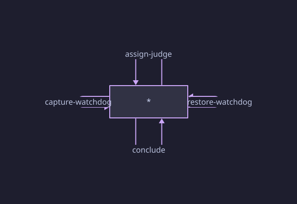

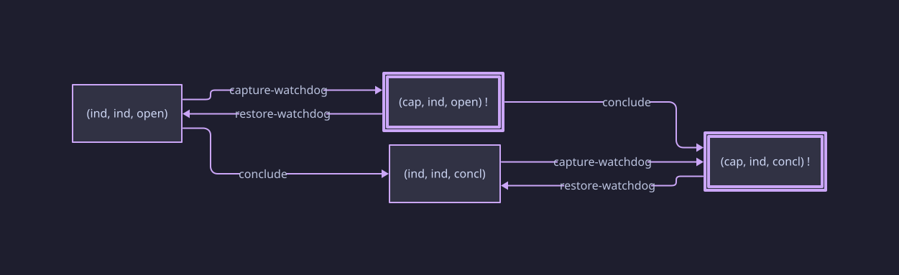

*(The math names: the move list is a quiver; a model assigns each edge a
partial map of the situation space — a functor; the generated graph,
with move sequences as routes, is the free category on it. A route is a
morphism; "can we get from here to there" is a question about
hom-sets.)*

### 12.4 Finiteness

Every construct denotes a finite object: enumerated types and rosters
are finite lists; chains are literal words; forms expand once,
referencing only earlier forms; `some` ranges over a roster. The
situation space is bounded by a product of finite domains;
consequently:

- generation of the meaning terminates;
- any property of the meaning can be decided by exhaustion;
- evidence for any verdict is a finite route or a finite set of
  situations.

## 13. Errors

Every error belongs to one stage and names a `line:col`:

| Stage  | Detects                                                                        |
| ------ | ------------------------------------------------------------------------------ |
| read   | malformed datums; malformed chain atoms; load cycles                           |
| expand | unknown forms; pattern mismatch; self- or forward-reference                    |
| parse  | unknown names; chain typing; domain violations; arity; role violations (§6.1) |
| static | unset fixed slots; invalid valuations; duplicate names                         |

## 14. Conformance

A conforming processor:

1. reads files and resolves `load` (§6.2);
2. expands forms to fixpoint (§11);
3. parses and checks all constraints of Part II;
4. on success, realises the meaning of §12 exactly — every reachable
   situation, edge, and gap edge; nothing more, nothing less;
5. rejects any file violating a constraint, with the prescribed stage
   and position (§13).

An implementation limit on situation count (at least 200 000) is
permitted; exceeding it is a distinct error, not a silent truncation.

---

# Part III — Standard tool interface *(normative for tools)*

The language defines what a model **is** (Part II). Questions about a
model live outside it, in the formats of this Part. A tool implementing
this Part is called an **interrogator** here; its files share the
reader and form expander of Part II and never alter a model's meaning.

## 15. Required reporting

On any successful build, an interrogator reports:

- **size** — reachable situations and edges;
- **gaps** — every gap edge, with message and minimal route in;
- **dead ends** — situations where no move is enabled (gap edges do not
  count as moves out — they are exits from the model, not moves within
  it);
- **laws** — for every (move, equation) pair, whether the move *can*
  break the law (guard-and-effect analysis); and every reachable
  situation violating an equation, with a minimal route.

```
states: 12   edges: 31
gaps: 1
  emergency-without-text — "both oversight paths blocked: …" (min 2 moves)
dead ends: none
equation same-agency
  can be broken by: capture-watchdog, restore-watchdog   (acknowledge in claims)
  violated in 4 reachable situations   witness: 1. capture-watchdog
```

## 16. Claims files

A `.claims` file holds questions; it may `load` libraries of question
forms.

### 16.1 Properties

- **Syntax** — `(property NAME ["DOC"] MODALITY)` with MODALITY one of:

| Modality         | Holds when                                                        |
| ---------------- | ----------------------------------------------------------------- |
| `(never F)`    | no reachable situation satisfies F                                |
| `(possible F)` | some reachable situation satisfies F                              |
| `(live F)`     | from every reachable situation, an F-situation is still reachable |

- F is a guard (§10.2), closed or with `some`-bound variables.
- A failing property is reported with a **shortest witness** — a route,
  printed as numbered moves.
- A holding **`possible`** also carries a witness: the shortest route to a
  satisfying situation — the example the question asked for (Appendix C's
  solvable river prints its crossing). `never` and `live` hold with no single
  witness.
- A property naming structure the schema lacks is **n/a** — never a
  pass.

*Example.*

```lisp
(property conviction-possible "the docket can conclude"
  (possible (is docket.stage concluded)))

(property accountability "the docket can always still conclude"
  (live (is docket.stage concluded)))
```

*Against the running example with a `capture-prosecutions` move added
and no restoration for it:*

```
holds  conviction-possible
fails  accountability
  stuck at: (prosecutions.independence=captured docket.stage=open …)
  witness:  1. capture-prosecutions
```

*Capture is a trap: one move, and no continuation ever concludes the
case. `possible` cannot see this; `live` can.*

### 16.2 Queries

- **Syntax** — `(query NAME (where (x TYPE)…) GUARD)`.
- **Meaning** — variables range over rosters; the answer is the set of
  satisfying bindings, at the initial situation or any addressed one.

```lisp
(query captured-bureaus
  (where (b bureau))
  (is b.independence captured))
```

```
captured-bureaus  (at state 7)
  b = watchdog
```

### 16.3 Acknowledgments — `accept`

- **Syntax** — `(accept TRANSITION EQUATION…)`.
- **Meaning** — records that the named move is known to be able to
  break the named laws.
  - can-break without `accept` → reported **unadmitted**;
  - `accept` naming a move that cannot break → reported **stale**;
  - acknowledged breakage still produces violation findings.

```lisp
(accept capture-watchdog same-agency)
(accept assign-judge same-agency)
; stale — assign-judge writes only case.judge and cannot affect same-agency
```

### 16.4 Dictionaries — `functor`, `check … via`

- **Syntax**

```lisp
(functor NAME (from SCHEMA) (to SCHEMA)
  [(over TYPE…)]
  (map X => Y)…)

(check SCHEMA.PROPERTY via NAME)
```

- **Meaning** — a dictionary from one schema into another: each type
  and arrow in scope mapped to a counterpart. Three checks, all
  mechanical:
  - **totality** — nothing in scope left untranslated;
  - **shape** — an arrow's translation runs between the translations of
    its endpoints;
  - **laws** — the image of each in-scope equation holds in the target's
    instance (checked there; marked `semantic`: a statement about this
    pair of models).
- `check … via` translates a property of the target schema back through
  the dictionary and evaluates it against this model.
  (*The dictionary is a functor — the same "consistent assignment"
  pattern as §9.1.*)

*Example. A later commit adds `(arrow reassigns (of bureau) (to case))`:*

```
functor eu-view: TOTALITY FAILS
  in-scope arrow `reassigns` (added in this version) has no image
```

*— the new power has no reading in the target's terms; the error names
the arrow.*

## 17. Comparison, search, and export

- **`pol compare OLD NEW [--map M]`** — builds both models and reports
  each equation and property **preserved / lost / gained** across the
  pair. Where schemas differ, M contains bare `(map X => Y)` datums;
  identity is assumed where names coincide; the pair is given by the
  invocation (old → new).

```
equations:   same-agency          preserved
properties:  conviction-possible  preserved
             accountability       LOST      witness: 1. capture-prosecutions
```

- **`pol control MODEL`** — emits the move list as data (an instance of
  the standard library's `quiver` schema), so dynamics can be queried
  and mapped with the same machinery; a dictionary between two models'
  move lists is a simulation map.
- **Fiber reporting** — a model gating its moves on a mode arrow can be
  interrogated per mode value:

```
live accountability:
  fiber regime=normal      holds
  fiber regime=emergency   FAILS   witness: …
```

- **`pol solve --morphism SMALL LARGE`** — searches for structure-
  preserving maps of SMALL's initial instance into LARGE's: one component
  per type, commuting with every arrow. Over finite rosters the search is
  complete — it reports every such map, or that provably none exists.
  This is the *morphism search* answering "does this configuration occur,
  structure preserved, inside that one?"
- **`pol check MODEL --symmetries`** — the same search from a model's
  initial instance to itself, reporting the structure-preserving
  automorphisms. Interchangeable entities are found this way, and the
  situation space may then be enumerated modulo them.
- **`pol check MODEL --universal TYPE`** — TYPE must be a junction type
  (§8.3) carrying an equation. Reports whether its roster is
  **exhaustive**: whether every tuple of the legs' rosters satisfying the
  equation is actually present as a member. The equation alone gives
  soundness — every rostered member satisfies it; this check gives
  completeness. A missing tuple is named.

```
pol check oversight.pol --universal joint-delegation
NOT UNIVERSAL: satisfying pair (mp-7, senator-3) has no element
```

- **`pol migrate --along F MODEL`** — re-expresses the instance of F's
  *target* schema in the terms of F's *source* schema, so a reference
  framework's configuration can be interrogated in a model's own
  vocabulary. F is a dictionary (§16.4). The direction reverses: a
  dictionary from S into T migrates instances from T back to S.

*(The categorical reading of all four — morphism search as natural
transformation, universality as a limit, migration as the pullback
functor Δ — is Appendix I.)*

`pol solve` has further modes — `--functor`, searching for maps between
*schemas*, and `--simulation`, searching between two models' control
quivers — specified by the relational extension, not here. They exit by
the same per-flag rule (§18).

## 18. Command line

```bash
pol check    MODEL.pol [--claims F.claims]
pol check    MODEL.pol --universal TYPE
pol check    MODEL.pol --symmetries
pol query    MODEL.pol NAME [--at STATE]
pol compare  OLD.pol NEW.pol [--map M.pol]
pol compare  --git REV1 REV2 MODEL.pol [--map M.pol]
pol control  MODEL.pol
pol solve    --morphism SMALL.pol LARGE.pol
pol migrate  --along F.pol MODEL.pol
```

Exit status: `0` — clean · `1` — a finding (failed property; violated,
unadmitted, or stale law result; lost-in-compare; non-universal roster)
· `2` — unreadable input.

**A search that finds nothing is a finding only where the absence is the
bad news.** The searches ask different questions, so they exit
differently, and each mode states which it is:

| Search                    | Asks                                                  | Nothing found |
| ------------------------- | ----------------------------------------------------- | ------------- |
| `pol solve --morphism`    | does this configuration occur inside that one?        | `0` — an answer |
| `pol solve --functor`     | has this structure any compliant reading in the target's terms? | `1` — with the obstruction |
| `pol solve --simulation`  | does every move of A have a counterpart in B?         | `1` — with the obstruction |
| `pol check --symmetries`  | which entities are interchangeable?                   | `0` — an answer |

A model that embeds nowhere, and one with no interchangeable entities,
are both ordinary negative answers. A structure with no reading in a
reference framework is the finding the interrogator exists to surface
(§16.4). The `--functor` and `--simulation` modes are specified by the
relational extension.

---

# Appendix A — Collected grammar

A convenience collection; the authoritative grammar is the **Syntax**
block of each construct in Part II.

Notation: `CAPS` are placeholders; `…` repeats the preceding item;
`[x]` is optional; everything else is literal.

```
file        ::= datum…
library     ::= (load-d | schema-d | instance-d | form-d)…
model       ::= library-datums… use-d initial-d transition-d…

load-d      ::= (load "FILE")
use-d       ::= (use SCHEMA)
initial-d   ::= (initial INSTANCE)

schema-d    ::= (schema NAME (type-d | arrow-d | equation-d)…)
type-d      ::= (type NAME)
              | (type NAME (VALUE…))
              | (type NAME arrow-d…)
arrow-d     ::= (arrow NAME (to TYPE) flag…)              ; in a type body
              | (arrow NAME (of TYPE) (to TYPE) flag…)    ; at schema top
flag        ::= fixed | vacatable
equation-d  ::= (equation NAME (= CHAIN CHAIN))

instance-d  ::= (instance NAME (of SCHEMA) clause…)
clause      ::= (TYPE ENTITY…)                            ; roster
              | (ARROW (ENTITY value)…)                   ; valuation
value       ::= VALUE | ENTITY | vacant

transition-d::= (transition [NAME] (when guard) (do effect…))
guard       ::= (and guard…) | (or guard…) | (not guard)
              | (is CHAIN value) | (defined CHAIN)
              | (some (VAR TYPE) guard)
              | NAME                                      ; nullary form
effect      ::= (set CHAIN value) | (vacate CHAIN) | (gap "MSG")

form-d      ::= (form PATTERN => TEMPLATE…)
              | (form NAME => DATUM)
PATTERN     ::= (NAME pat-item…)
pat-item    ::= SLOT | &rest SLOT | literal-datum
TEMPLATE    ::= datum with SLOT substitution and @SLOT splice

CHAIN       ::= ATOM.ATOM[.ATOM…]                         ; lexical (§5.2)
```

# Appendix B — Keyword index

| Word          | Section | Word                   | Section |
| ------------- | ------- | ---------------------- | ------- |
| `load`      | §6.2   | `transition`         | §10.1  |
| `use`       | §9.4   | `when`               | §10.1  |
| `initial`   | §9.4   | `do`                 | §10.1  |
| `schema`    | §8.1   | `set`                | §10.3  |
| `type`      | §8.2   | `vacate`             | §10.3  |
| `arrow`     | §8.3   | `gap`                | §10.4  |
| `to`        | §8.3   | `and` `or` `not` | §10.2  |
| `of`        | §8.3   | `is`                 | §10.2  |
| `fixed`     | §8.3   | `defined`            | §10.2  |
| `vacatable` | §8.3   | `some`               | §10.2  |
| `equation`  | §8.6   | `form`               | §11.1  |
| `=`         | §8.6   | `&rest`              | §11.1  |
| `instance`  | §9.1   | `vacant`             | §9.3   |

Twenty-eight words. The Part III vocabulary — `property`, `never`,
`possible`, `live`, `query`, `where`, `accept`, `check`, `via`,
`functor`, `from`, `over`, `map` — belongs to tool file formats, not to
the language. Ordering, quantifier duals, relations, and domain words
belong to libraries; dates, citations, versions, and history belong to
version control.

# Appendix C — The river

*The Prologue's river crossing.*

```lisp
(schema river
  (type bank (left right))
  (type traveler
    (arrow at (to bank)))
  (type cargo
    (arrow at (to bank) vacatable)))     ; eaten: nowhere — Wish 2

(instance start (of river)
  (traveler farmer)
  (cargo wolf goat cabbage)
  (at (farmer left) (wolf left) (goat left) (cabbage left)))

(use river)
(initial start)

; SAFE: no predator is stranded with its prey — no danger pair shares a bank the
; farmer has left. Appetite is not a move the farmer may decline, so he may act
; only from a safe arrangement; strand prey and he is frozen, leaving the eat as
; the only move. (Without this guard `(possible solvable)` "solves" the puzzle by
; a shorter path that merely never *chooses* to let anything be eaten.)
(form safe =>
  (not (or (and (is wolf.at left)  (is goat.at left)     (is farmer.at right))
           (and (is wolf.at right) (is goat.at right)    (is farmer.at left))
           (and (is goat.at left)  (is cabbage.at left)  (is farmer.at right))
           (and (is goat.at right) (is cabbage.at right) (is farmer.at left)))))

; compound moves, named once — Wish 11
(form (row FROM TO)
  => (transition (when (and safe (is farmer.at FROM))) (do (set farmer.at TO))))

(form (ferry C FROM TO)
  => (transition
       (when (and safe (is farmer.at FROM) (is C.at FROM)))
       (do (set farmer.at TO) (set C.at TO))))

(row left right)            (row right left)
(ferry wolf left right)     (ferry wolf right left)
(ferry goat left right)     (ferry goat right left)
(ferry cabbage left right)  (ferry cabbage right left)

; nature's move: on a bank the farmer has left, appetite acts — and from an
; unsafe arrangement it is the ONLY enabled move, so it fires.
(form (eats P Q BANK OTHER)
  => (transition
       (when (and (is P.at BANK) (is Q.at BANK) (is farmer.at OTHER)))
       (do (vacate Q.at))))              ; the eaten piece is gone

(eats wolf goat left right)     (eats wolf goat right left)
(eats goat cabbage left right)  (eats goat cabbage right left)
```

*The questions, kept apart from the puzzle (Wish 12) — `river.claims`:*

```lisp
(property solvable
  "everything can reach the right bank intact"
  (possible (and (is farmer.at right) (is wolf.at right)
                 (is goat.at right)   (is cabbage.at right))))

(property no-blunders
  "from every reachable arrangement, the crossing can still succeed"
  (live (and (is farmer.at right) (is wolf.at right)
             (is goat.at right)   (is cabbage.at right))))
```

*The report:*

```
holds  solvable
  witness:
  1. ferry goat left→right      5. ferry cabbage left→right
  2. row right→left             6. row right→left
  3. ferry wolf left→right      7. ferry goat left→right
  4. ferry goat right→left

fails  no-blunders
  stuck at: (farmer.at=right wolf.at=left goat.at=left cabbage.at=left)
  witness:
  1. row left→right             ; the farmer crosses alone, stranding all three —
                                ;   frozen now, appetite is the only move left
```

*Design note.* Appetite is **forced**, not optional: the `safe` guard lets the
farmer act only from an arrangement where no predator is stranded with its prey,
so a careless crossing freezes him and the eat fires. This is what makes
`solvable`'s witness a real, safe crossing — bringing the goat *back* on move 4 —
rather than a shorter route that reaches the far bank only by never *choosing* to
let anything be eaten; and it is why `no-blunders` fails one move in, the instant
prey is stranded. Modelling nature as an ordinary move that the search may
decline is the trap the guard closes.

*Variants are commits (Wish 10): add a two-passenger `ferry2` form;
`pol compare --git HEAD~1 HEAD river.pol` reports whether `no-blunders`
was gained.*

# Appendix D — The island

*The Prologue's knights and knaves. The kind of a native is a
**vacatable** slot (Wish 2).*

```lisp
(schema island
  (type kind-t  (knight knave))
  (type claim-t (said-knight said-knave))
  (type native
    (arrow claims (to claim-t) fixed)      ; the recorded utterance
    (arrow kind   (to kind-t) vacatable))) ; unclassified until read

(instance census (of island)
  (native abe bea cal)
  (claims (abe said-knight) (bea said-knight) (cal said-knave))
  (kind   (abe vacant) (bea vacant) (cal vacant)))

(use island)
(initial census)

; the island's law, applied as moves:
; "I am a knight" is consistent with either kind — two readings, two moves
(form (read-knight-sayer N)
  => (transition
       (when (and (is N.claims said-knight) (not (defined N.kind))))
       (do (set N.kind knight)))
     (transition
       (when (and (is N.claims said-knight) (not (defined N.kind))))
       (do (set N.kind knave))))

; "I am a knave" is consistent with neither — the rules are silent
(form (read-knave-sayer N)
  => (transition
       (when (and (is N.claims said-knave) (not (defined N.kind))))
       (do (gap "no consistent kind exists for this speaker: the island's rules are silent"))))

(read-knight-sayer abe)
(read-knight-sayer bea)
(read-knave-sayer cal)
```

*`island.claims`:*

```lisp
(property census-completable
  "every native can be assigned a kind"
  (possible (and (defined abe.kind) (defined bea.kind) (defined cal.kind))))

(query possible-knights
  (where (n native))
  (is n.kind knight))
```

*The report:*

```
states: 9   edges: 12
gaps: 1
  read-knave-sayer cal — "no consistent kind exists for this speaker:
  the island's rules are silent" (min 1 move)                 ; Wish 9
dead ends: none

fails  census-completable
  ; cal.kind can never be defined: the only move that reads cal
  ; is a declared hole

possible-knights  (at state 5)
  n = abe                                                      ; Wish 6
  n = bea
```

# Appendix E — Why seven ideas, no more, no fewer

*Seven is the size of an independent set: drop any one idea, and a
coherent language remains that satisfies the other six — a language
that exists. Each idea is therefore a genuine decision, witnessed by
the neighbour you get without it:*

| Dropped idea                                   | The language you get instead                                                                                                                            |
| ---------------------------------------------- | ------------------------------------------------------------------------------------------------------------------------------------------------------- |
| 1 — the absent is representable               | sentinel members and explicit "end" states — most UML and state-chart practice; `null` everywhere                                                     |
| 2 — law is an observable                      | laws that prune: an Alloy `fact` deletes violating worlds — "which move breaks the law" can no longer be asked, the broken world is gone              |
| 3 — a small text denotes a fully known object | unbounded domains, bounded checking or sampling — TLA+ over infinite state, property-based testing; "no counterexample found" in place of "impossible" |
| 4 — definition apart from interrogation       | assertions inline in the model — TLA+ theorems, Alloy `check` blocks beside the spec                                                                  |
| 5 — two times, two systems                    | in-language version blocks — model files carrying their own history and dates                                                                          |
| 6 — rules, not actors                         | actor-annotated moves — process calculi; multi-agent frameworks with `by`-clauses                                                                     |
| 7 — vocabulary grows, meaning does not        | computing macros — Lisp: expressive, and errors stop pointing at lines the author wrote                                                                |

*Two witnesses separate ideas that look mergeable. TLA+ satisfies
idea 2 — invariants are checked, not assumed — while violating idea 4:
theorems live in the spec file. So "the model is inviolate" is two
decisions, not one. A language with in-file version blocks satisfies
idea 3 while violating idea 5 — so "time is derived" and "authorship
time belongs to version control" are separable too.*

*The count is pinned from both sides. Not fewer: each idea has a
nearby-language witness, so none is derivable from the others —
removing one does not shorten the list, it changes the language into
one of the seven neighbours above. Not more: the grant-tags of §1
cover all twelve wishes, so an eighth idea would either grant nothing
or grant something no puzzle asked for.*

# Appendix F — The wish list, answered

*Each wish of the Prologue, and the construct that answers it:*

| Wish                                                      | In the language                             | Where               |
| --------------------------------------------------------- | ------------------------------------------- | ------------------- |
| 1 — kinds of pieces, and what each points at             | `schema`, `type`, `arrow`             | §8                 |
| 2 — one starting arrangement; "nothing" stated as itself | `instance`; `vacant`, `vacatable`     | §9, §8.3          |
| 3 — moves as a condition and a change                    | `transition`, `when`, `do`            | §10                |
| 4 — every sequence tried; "impossible" is proved         | the meaning of a model                      | §12                |
| 5 — every verdict shows its route                        | witnesses                                   | §13–16            |
| 6 — list answers: which cases satisfy this               | queries                                     | §16.2              |
| 7 — laws declared; violations flagged and traced         | `equation`; violation reports; `accept` | §8.6, §15, §16.3 |
| 8 — points of no return detected                         | `live`                                    | §16.1              |
| 9 — silent rules marked as holes                         | `gap`                                     | §10.4              |
| 10 — variants compared: gained and lost                  | git; `pol compare`                         | §6.3, §17         |
| 11 — compound moves named, tool unchanged                | `form`                                    | §11                |
| 12 — questions kept apart from the puzzles               | claims files                                | §16                |

# Appendix G — Problems tractable with Pol

*A problem fits when its world has finitely many kinds of pieces, its
rules read as "only if … then this changes", its laws read as "these two
routes must agree", and its questions are reachability, liveness, lists,
or silence. Out of scope: quantities, probabilities, continuous time, and
unbounded populations — unless honestly reduced to small named scales.*

Every domain below asks the same six shapes of question — trap, law
violation, vacancy, silence, comparison, embedding — of different
furniture; §3 works three of them through to their mechanisms.

**Constitutional design.** Organs, powers, and the laws between them.

- Can lawful moves alone permanently disable the anti-corruption pipeline?
- Which single appointment creates a veto pair that blocks every remaining path?
- Once emergency powers are invoked, can normal order always still be restored?
- Which powers can violate the separation law, and is every one acknowledged?
- Does the proposed amendment preserve the impeachment path, or quietly close it?
- Is there a sequence of vacancies after which no organ can convene the appointments that would fill them?
- Does the architecture have any reading in the accession framework's terms — and if not, which power broke it?

**Legislative procedure.** A bill against the standing orders.

- Can a bill be enacted while skipping committee review — and which standing orders does that route break?
- Is enactment always still reachable after a veto, at every support level the model names?
- Which motion sequences leave the chamber with no move enabled?
- Which parliamentary situations have no covering rule at all?
- Did the rules reform lose the minority's ability to force a recorded vote?
- Does each chamber's procedure translate honestly into the union's joint procedure?

**Regulated case-work** (KYC, claims, dockets). Cases, reviewers, units of record.

- Can a case reach a state that is neither settleable nor closable — alive forever?
- Which reassignment moves can break the approver-belongs-to-unit law?
- With the reviewer slot vacant, can every open case still complete?
- Which cases violate separation of duty now, and by what route did each get there?
- Which case configurations hit the escalation hole where the automated process ends?
- Did the new triage step lose the guarantee that every complaint reaches a decision?

**Access and privilege.** Grants, revocations, delegation chains.

- Is there a grant sequence after which some privilege can never be revoked?
- Which grant or delegate moves can break the every-admin-traces-to-root law?
- Can an account reach admin capability without ever holding the auditor-visible role?
- With the security root vacated, is recovery of control still possible?
- Does the production configuration embed, structure preserved, in the approved reference model?
- Which accounts hold conflicting duties now, and through which grants?

**Safety interlocks and operating procedures.** Machine states and lockout rules.

- Can the door be open while the beam is on — and by which move sequence?
- Is safe shutdown always still available from every reachable state?
- Which maintenance moves can break the lockout law, and are they acknowledged?
- Are there machine states with no enabled move and no declared hole — silence nobody wrote?
- Did the retrofit lose the guarantee that venting is reachable from every fault state?

**Clinical and trial protocols.** Subjects through screening, arms, completion, withdrawal.

- Can a subject be randomized twice under any sequence of protocol moves?
- After a withdrawal — the subject gone, as itself — can the cohort still reach completion?
- Which transfers between arms can break the eligibility law?
- Is completion always still reachable after each deviation the protocol names?
- Which subject states does the protocol text not cover?
- Does the site's local procedure translate honestly into the sponsor's protocol?

**Succession and titles.** Offices, heirs, regencies; vacancy is native.

- Can the title become permanently vacant under the written succession law?
- Which sequence of deaths and renunciations leaves no lawful successor — and how short is the shortest?
- Once declared, can a regency always still be ended?
- Which acts of the council can break the primogeniture law?
- Is there a reachable state with two lawful claimants at once?
- Does the cadet branch's rule embed in the main line's?

**Incident-response runbooks.** Alert states, containment moves, communication gates.

- From every reachable incident state, is recovery still reachable?
- Can containment be entered so that forensics becomes unreachable afterwards?
- Which steps can break the notify-before-disclose law?
- Which incident states hit the runbook's declared end — and which hit silence nobody declared?
- Did the revision lose the ability to roll back after failover?

**Game and puzzle design.** Boards, pieces, moves, endings.

- Is the puzzle solvable — and what is the shortest solution?
- Does a first-move blunder exist that makes winning unreachable?
- Is every dead end a designed ending rather than an accident?
- Does the two-player variant preserve solvability?
- Which piece configurations violate the game's own placement law?
- Does the tutorial level embed in the full game, moves preserved?

# Appendix H — Design notes: neighbouring languages

The niche is partially occupied. The nearest neighbours, and where each
parts ways with the Prologue's wish list and the ideas of §1:

| Neighbour                            | Covers                                                                                                                                             | Parts ways                                                                                                                                                     |
| ------------------------------------ | -------------------------------------------------------------------------------------------------------------------------------------------------- | ---------------------------------------------------------------------------------------------------------------------------------------------------------- |
| Alloy 6 (with temporal operators)    | signatures/relations ≈ schema; `lone` ≈ `vacatable`; exhaustive instances and traces at exact scopes; `var` fields as state                        | a `fact` prunes — the axiom semantics idea 2 rejects; linear-time operators cannot state `live`; claims live in the model file; no `gap`/dead-end distinction |
| Event-B + ProB                       | guarded events ≈ `when`/`do`; partial functions native; invariants checked, not assumed; ProB speaks CTL, so `live` is expressible; refinement ≈ a disciplined `compare` | heavyweight tooling; a set-theoretic surface domain experts cannot read; claims in-machine; refinement is proof-ordered, not diff-shaped                       |
| TLA+ / TLC                           | actions are exactly a condition and a change; exhaustive at finite configuration; invariants checked                                                | linear-time only — `live` (AG EF) not expressible in the checker; no partiality (sentinels); theorems live in the spec file                                    |
| NuSMV, mCRL2                         | CTL / mu-calculus — `live` native; state space exported as an artifact; simulation and bisimulation checks                                         | no ontology layer: flat variables or process algebra; no partiality; no surface a lawyer reads                                                                 |
| Answer-set programming (clingo)      | list answers native; weak constraints ≈ law as observable; absence representable                                                                   | everything encodable, nothing given: no schema or translation story, no route witnesses                                                                        |
| Catlab.jl / ACSets                   | the mathematical lineage itself: Ologs, instances, functors, migrations; rewriting as dynamics                                                      | a library, not a notation; total functors; no claims layer, no witness discipline                                                                              |

Two things fall out. **Branching time is the sharpest divide.** `live` —
"from every reachable situation the goal remains reachable" — is a
branching-time property; the mainstream temporal tools are linear-time,
and the tools that do speak branching time have no ontology surface. The
trap-detector wish sits in that gap. **Five things appear in no
neighbour, in any combination:** the `accept` ledger of owned
law-breakage; declared silence distinguished from an unannounced dead
end; claims as separate files reusable across models; version control as
the version axis, with preserved / lost / gained reports; and a
vocabulary layer that cannot compute, so every error points at an
authored line.

**Build versus adopt.** The closest adoption path is Alloy 6 under
discipline: a style rule of "no facts — laws are checked predicates
only", a reified step relation whose transitive closure approximates
`live` within bounds, and a thin wrapper turning git pairs into
`compare` reports. That reaches most of wishes 1–8 and 10, partially.
Not recoverable there: `gap`, a template layer whose errors point at
authored lines, and a path-equation surface a domain expert can read.
The alternative is Event-B with ProB — the one neighbour with both
partiality and branching time — at the cost of every reader who is not a
formal-methods practitioner. Weighing those two costs against a new
small language is the build-versus-adopt decision; this specification is
the build branch.

# Appendix I — Pol as a category-theory workbench

*How each classical categorical concept — category, functor, natural
transformation, limit, pullback, colimit, adjunction — is expressed in
Pol. The thesis in one sentence:*

> **Pol never spells these concepts as keywords. Each one is either the
> *semantics* of an existing construct, a *pattern* written with existing
> words, or a *verb* of the interrogator — and knowing which is which is
> knowing the design.**

All examples use the running example of §4.

**Where each concept lives:**

| Concept                | Home                                       | Spelled as                                            |
| ---------------------- | ------------------------------------------ | ----------------------------------------------------- |
| Category               | language (semantics)                       | `schema`; the derived state category                  |
| Functor                | language (semantics) ×2, interrogator ×3   | `instance`, `transition`; `functor` / `compare` / `solve` |
| Natural transformation | interrogator                               | `pol solve --morphism`                                |
| Limit / Pullback       | language (pattern) + interrogator          | span + `equation`; `pol check --universal`            |
| Colimit / Pushout      | language (semantics of `load`)             | idempotent `load`                                     |
| Adjunction             | theory + interrogator                      | `pol migrate --along` (Δ of Δ ⊣ Σ ⊣ Π)                |

## I.1 Categories

Pol contains **three** categories per model — two presented, one derived.

**The world category** is what `schema` declares (§8): objects are types,
morphisms are arrows and their composites (paths), and equations impose
the relations. This is precisely a finitely presented category — an Olog:


**The control quiver** is the second presented structure: one edge per
`transition` (§10). It is deliberately just a quiver (a graph, no
equations) — the free category on it is generated, not written.

**The derived state category** is what the interrogator computes: objects
are reachable situations, morphisms are move sequences, composition is
concatenation, identities are "do nothing". It is the free category on
the reachable transition graph (§12.3). Nobody writes it; everybody
interrogates it — every modality is a hom-set question about it, and
every witness is one of its morphisms.


## I.2 Functors

Pol contains **five** functors, in three homes. None is a kernel keyword.

**Functor 1 — the instance.** `instance` *is* a functor from the world
category to Par(FinSet) (§9.1): open types go to rosters, enumerated
types to their declared sets, arrows to (partial) functions.
Functoriality is what the build checks when it validates every cell
against dom and cod:

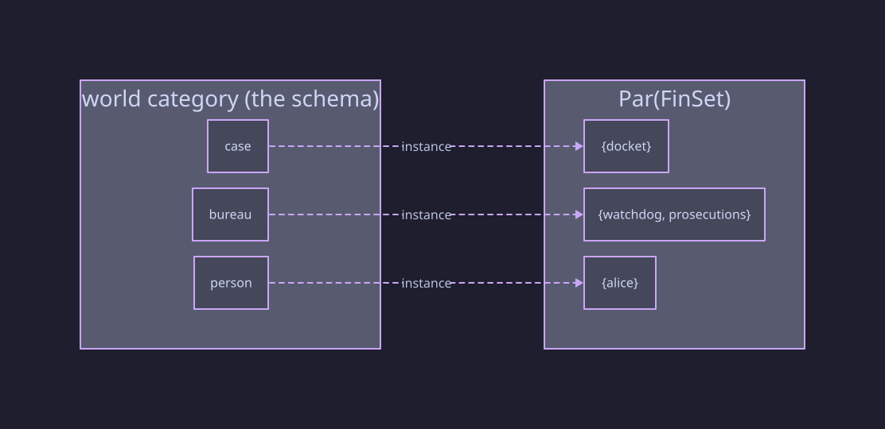

**Functor 2 — the dynamics.** The set of `transition` datums *is* a
functor from the control quiver to partial endo-maps of the instance
space: each edge is sent to the map whose domain of definition is the
`when` and whose action is the `do`. A transition datum is the
tabulation of this functor at one edge:

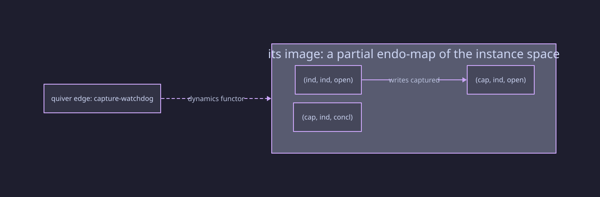

(Note the partiality drawn: the map is undefined at the situations
already captured — no arrow leaves them.)

**Functors 3–5 — the interrogator's.** Between *schemas*, functors are
declared in claims files (§16.4) and used three ways: **transport** (pull
a reference schema's properties back along the map), **compare** (a map
file of bare `(map X => Y)` datums relating two versions' schemas, §17),
and **solve** (search for the maps rather than write them, §17):

```lisp
(functor eu-view (from oversight) (to eu-accession)
  (over bureau case)
  (map bureau => watchdog-body)
  (map independence => autonomy))

(check eu-accession.accountability via eu-view)
```

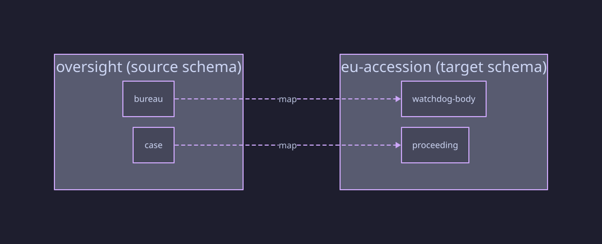

What the tool checks is exactly functoriality made finite: totality over
the scope, dom/cod preservation, and equation preservation (semantic —
evaluated against the target's instance). A failed totality check is the
early-warning system: a new arrow with no image *names the power that has
no compliant reading in the target's terms*.

## I.3 Natural transformations

Between two instances X, Y of one schema — two functors to Par(FinSet) —
a natural transformation is an **instance homomorphism**: one component
map per type, commuting with every arrow. The naturality square,
concretely:

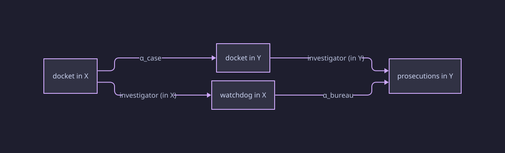

Both routes from "docket in X" to the bottom-right must agree: mapping
the case and then taking its investigator equals taking the investigator
and then mapping the bureau. That *is* naturality, and over finite
rosters it is a finite check — so the interrogator searches for such maps
completely (§17):

```bash
pol solve  --morphism small.pol large.pol   # embeddings, all of them or provably none
pol check  model.pol --symmetries           # natural automorphisms → enumerate modulo symmetry
```

Three uses, one mechanism: **embedding** (does this configuration occur,
structure preserved, inside that one?), **symmetry reduction** (a natural
automorphism of the initial instance — two interchangeable bureaus —
induces a symmetry of the whole state category; enumerate the quotient),
and **translations between readings** (a natural transformation between
two functors to a common target relates two compliance interpretations
systematically).

## I.4 Limits and pullbacks

The kernel deliberately has no `pullback` keyword — because the *shape*
is already writable, and only the *universal property* needs a tool.

**Declaring the shape** is a span plus an equation. "A joint delegation
is an MP and a senator from the same region":

```lisp
(type joint-delegation
  (arrow p1 (to mp) fixed)
  (arrow p2 (to senator) fixed))
(equation same-region
  (= joint-delegation.p1.region joint-delegation.p2.region))
```

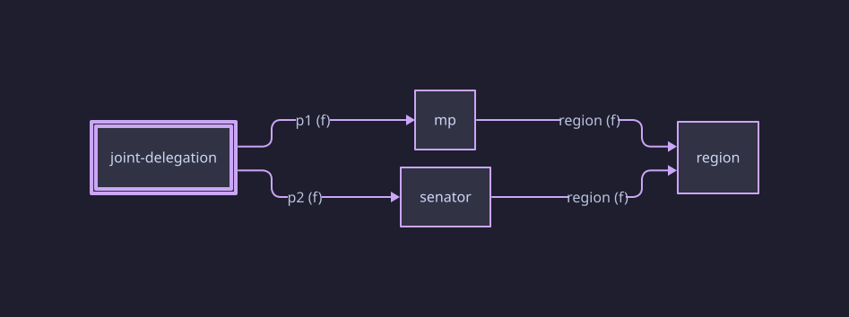

The equation gives **soundness**: every rostered delegation really is
same-region. What no declaration can give is **completeness** — that the
roster contains *all* same-region pairs. That is the universal property
of the pullback `mp ×_region senator`, and over finite rosters it is one
scan (§17):

```bash
pol check oversight.pol --universal joint-delegation
# NOT UNIVERSAL: satisfying pair (mp-7, senator-3) has no element
```

Products (span, no equation) and equalizers (one arrow pair, one
equation) follow the identical pattern: shape in the language,
universality in the tool. The split is principled, not accidental — the
shape is *ontology* (what a joint delegation is), universality is a
*claim about an instance* (this roster is exhaustive), and Pol keeps
ontology and claims in different places by design (Pivotal idea 4).

## I.5 Colimits and pushouts

One colimit is load-bearing in the kernel itself: **`load` computes the
pushout of libraries along their shared base** (§6.2). Loading is
idempotent per file — each file's datums enter the universe once, however
many load paths reach it — which is exactly gluing along the shared part
rather than a coproduct that would explode every diamond into
redeclaration errors:


Two libraries with *no* shared base glue along the empty library — the
pushout degenerates to the coproduct, which is why loading two unrelated
libraries is also just correct. The general lesson repeats the thesis:
the colimit is not a keyword; it is the *semantics of an existing word*,
and getting it wrong (textual inclusion) was a bug the categorical
reading diagnosed.

Colimits of *instances* (two configurations glued along a shared part)
are writable by hand — rosters and valuations union, shared entities
listed once — and deliberately have no dedicated verb: the finite case is
plain bookkeeping.

## I.6 Adjunctions

Adjunctions in Pol are **theory that guarantees the verbs compose** —
never syntax. Two of them are present.

**Data migration: Δ ⊣ Σ ⊣ Π.** A schema functor F : S → T induces, on
instances, the *pullback migration* Δ_F going the other way —
re-expressing a T-instance in S's terms. That is `pol migrate --along F`
(§17), used to import a reference framework's configuration into a
model's own vocabulary for side-by-side interrogation:

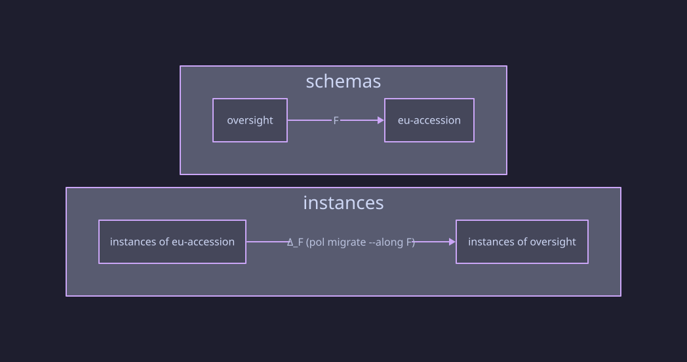

Note the reversal of direction between the two rows — the signature of a
contravariant induced map, and the thing the adjunction organizes: Δ_F
has a left adjoint Σ_F (freely add what's missing) and a right adjoint
Π_F (demand unique matches), and the adjunction laws are what guarantee
the three compose coherently when Σ and Π arrive as verbs. The adjunction
is never declared; it is the *correctness argument* for the tooling.

**Free ⊣ forgetful.** The second adjunction is already silently at work:
the derived state category is the **free category** on the reachable
transition graph — the left adjoint of the forgetful functor from
categories to graphs, applied by the interrogator every time it
enumerates. "Time is the free category on what the moves generate" is
this adjunction, stated as semantics.

# Appendix J — Categorical cheat-sheet

| Concept                      | Pol expression                                   | Checked / computed by                               |
| ---------------------------- | ------------------------------------------------ | --------------------------------------------------- |
| Category (presented)         | `schema` — types, arrows, equations              | build: dom/cod chains, path typing                  |
| Category (derived)           | state category — free on the reachable graph     | interrogator: enumeration                           |
| Functor (instance)           | `instance` : Schema → Par(FinSet)                | build: cells vs dom/cod, totality of fixed          |
| Functor (dynamics)           | `transition` datums : quiver → partial endo-maps | build: guard/effect validation                      |
| Functor (schemas)            | `functor` in claims; map files; solved           | interrogator: totality, dom/cod, semantic equations |
| Natural transformation       | instance homomorphism                            | `pol solve --morphism`, `--symmetries`              |
| Pullback / limit             | span + `equation` (the shape)                    | `pol check --universal` (the universality)          |
| Pushout / colimit            | idempotent `load` along shared base              | build: the gluing itself                            |
| Adjunction Δ ⊣ Σ ⊣ Π         | `pol migrate --along` (Δ today)                  | interrogator; adjunction = correctness argument     |
| Adjunction free ⊣ forgetful  | the state category's very existence              | interrogator: enumeration                           |

Reading the table columnwise is reading the design: the *language* column
contains only what defines a model; the *tool* column contains every
question and every search; and no row needed a new kernel word — the
twenty-eight are enough.
